# [📈 Live Status](https://kizzna.github.io/bovorn-mon): <!--live status--> **🟧 Partial outage**

This repository contains the open-source uptime monitor and status page for [kizzna](https://kizzna.github.io/bovorn-mon), powered by [Upptime](https://github.com/upptime/upptime).

With [Upptime](https://upptime.js.org), you can get your own unlimited and free uptime monitor and status page, powered entirely by a GitHub repository. We use [Issues](https://github.com/kizzna/bovorn-mon/issues) as incident reports, [Actions](https://github.com/kizzna/bovorn-mon/actions) as uptime monitors, and [Pages](https://kizzna.github.io/bovorn-mon) for the status page.

<!--start: status pages-->
<!-- This summary is generated by Upptime (https://github.com/upptime/upptime) -->
<!-- Do not edit this manually, your changes will be overwritten -->
<!-- prettier-ignore -->
| URL | Status | History | Response Time | Uptime |
| --- | ------ | ------- | ------------- | ------ |
|  MON 1 | 🟥 Down | [mon-1.yml](https://github.com/kizzna/bovorn-mon/commits/HEAD/history/mon-1.yml) | 

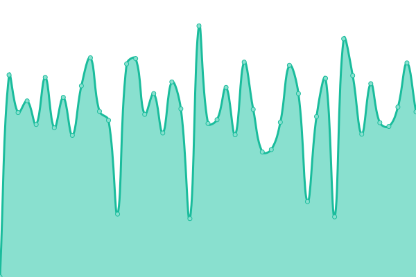 926ms
     
 | 

<a href="https://kizzna.github.io/bovorn-mon/history/mon-1">99.60%</a>
    

|  MON 2 | 🟥 Down | [mon-2.yml](https://github.com/kizzna/bovorn-mon/commits/HEAD/history/mon-2.yml) | 

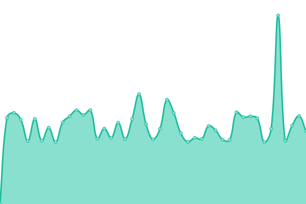 305ms
     
 | 

<a href="https://kizzna.github.io/bovorn-mon/history/mon-2">98.22%</a>
    

|  MON 3 | 🟥 Down | [mon-3.yml](https://github.com/kizzna/bovorn-mon/commits/HEAD/history/mon-3.yml) | 

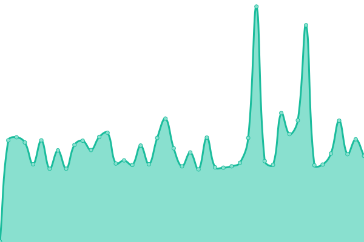 299ms
     
 | 

<a href="https://kizzna.github.io/bovorn-mon/history/mon-3">98.25%</a>
    

|  MON 4 | 🟥 Down | [mon-4.yml](https://github.com/kizzna/bovorn-mon/commits/HEAD/history/mon-4.yml) | 

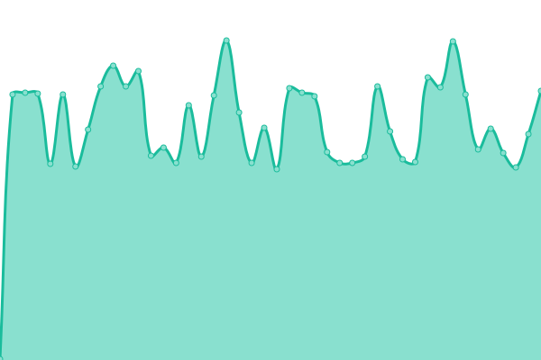 296ms
     
 | 

<a href="https://kizzna.github.io/bovorn-mon/history/mon-4">98.29%</a>
    

|  MON 5 | 🟥 Down | [mon-5.yml](https://github.com/kizzna/bovorn-mon/commits/HEAD/history/mon-5.yml) | 

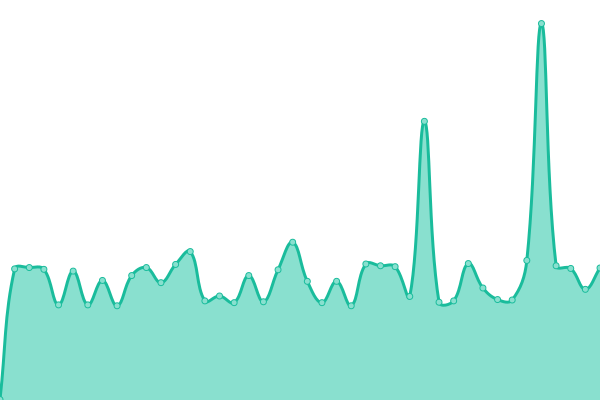 297ms
     
 | 

<a href="https://kizzna.github.io/bovorn-mon/history/mon-5">98.35%</a>
    

|  MON 6 | 🟥 Down | [mon-6.yml](https://github.com/kizzna/bovorn-mon/commits/HEAD/history/mon-6.yml) | 

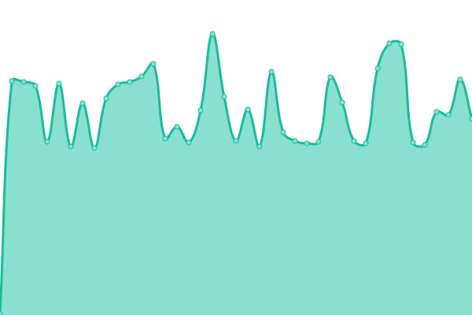 297ms
     
 | 

<a href="https://kizzna.github.io/bovorn-mon/history/mon-6">98.41%</a>
    

|  MON 7 | 🟥 Down | [mon-7.yml](https://github.com/kizzna/bovorn-mon/commits/HEAD/history/mon-7.yml) | 

 299ms
     
 | 

<a href="https://kizzna.github.io/bovorn-mon/history/mon-7">18.86%</a>
    

|  MON 8 | 🟥 Down | [mon-8.yml](https://github.com/kizzna/bovorn-mon/commits/HEAD/history/mon-8.yml) | 

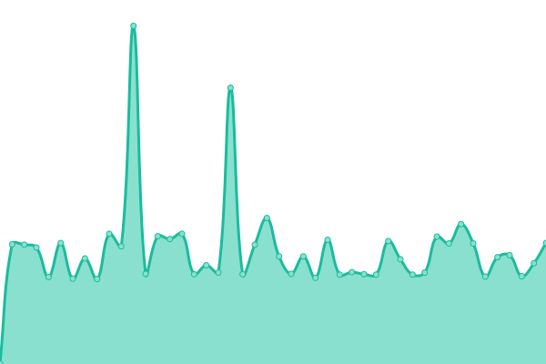 296ms
     
 | 

<a href="https://kizzna.github.io/bovorn-mon/history/mon-8">98.50%</a>
    

|  MON 9 | 🟥 Down | [mon-9.yml](https://github.com/kizzna/bovorn-mon/commits/HEAD/history/mon-9.yml) | 

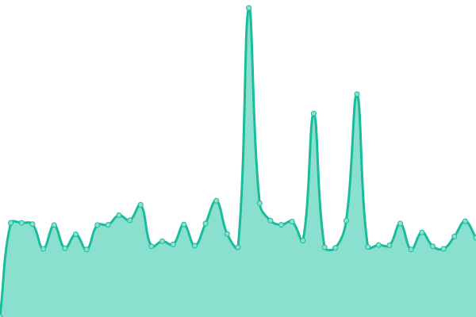 297ms
     
 | 

<a href="https://kizzna.github.io/bovorn-mon/history/mon-9">98.52%</a>
    

|  MON 10 | 🟥 Down | [mon-10.yml](https://github.com/kizzna/bovorn-mon/commits/HEAD/history/mon-10.yml) | 

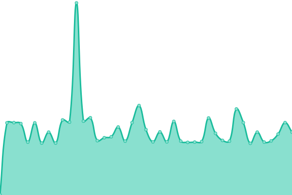 297ms
     
 | 

<a href="https://kizzna.github.io/bovorn-mon/history/mon-10">98.58%</a>
    

|  MON 11 | 🟥 Down | [mon-11.yml](https://github.com/kizzna/bovorn-mon/commits/HEAD/history/mon-11.yml) | 

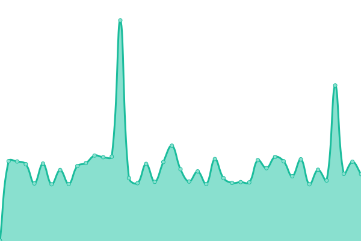 298ms
     
 | 

<a href="https://kizzna.github.io/bovorn-mon/history/mon-11">98.66%</a>
    

|  MON 12 | 🟩 Up | [mon-12.yml](https://github.com/kizzna/bovorn-mon/commits/HEAD/history/mon-12.yml) | 

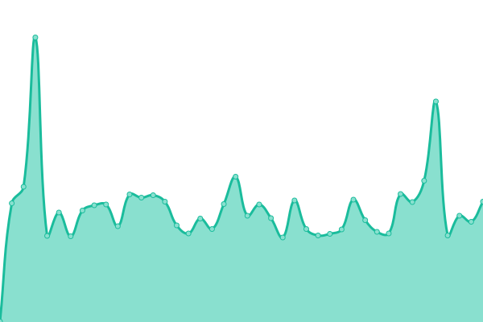 446ms
     
 | 

<a href="https://kizzna.github.io/bovorn-mon/history/mon-12">98.69%</a>
    

|  MON 13 | 🟥 Down | [mon-13.yml](https://github.com/kizzna/bovorn-mon/commits/HEAD/history/mon-13.yml) | 

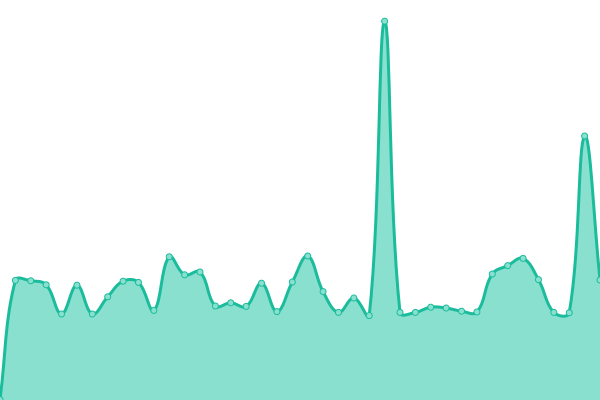 299ms
     
 | 

<a href="https://kizzna.github.io/bovorn-mon/history/mon-13">98.73%</a>
    

|  MON 14 | 🟩 Up | [mon-14.yml](https://github.com/kizzna/bovorn-mon/commits/HEAD/history/mon-14.yml) | 

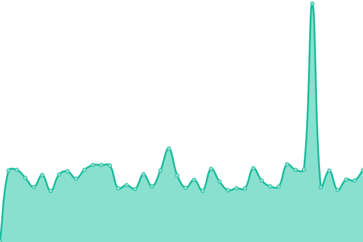 286ms
     
 | 

<a href="https://kizzna.github.io/bovorn-mon/history/mon-14">98.79%</a>
    

|  MON 15 | 🟩 Up | [mon-15.yml](https://github.com/kizzna/bovorn-mon/commits/HEAD/history/mon-15.yml) | 

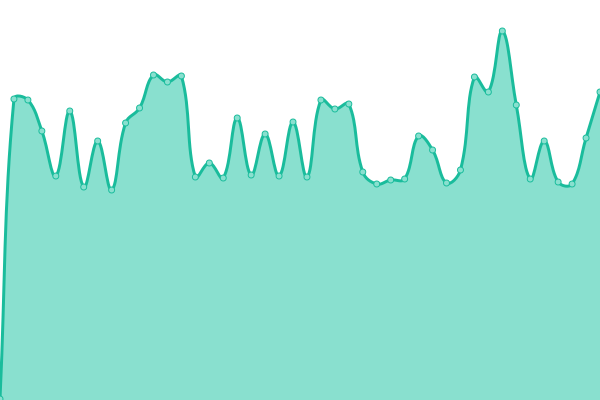 290ms
     
 | 

<a href="https://kizzna.github.io/bovorn-mon/history/mon-15">98.85%</a>
    

|  MON 16 | 🟥 Down | [mon-16.yml](https://github.com/kizzna/bovorn-mon/commits/HEAD/history/mon-16.yml) | 

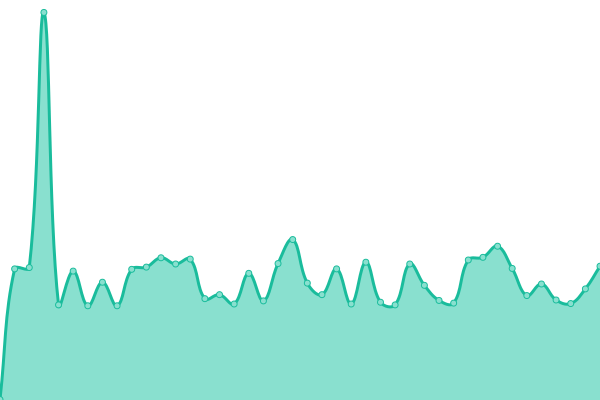 297ms
     
 | 

<a href="https://kizzna.github.io/bovorn-mon/history/mon-16">98.89%</a>
    

|  MON 17 | 🟥 Down | [mon-17.yml](https://github.com/kizzna/bovorn-mon/commits/HEAD/history/mon-17.yml) | 

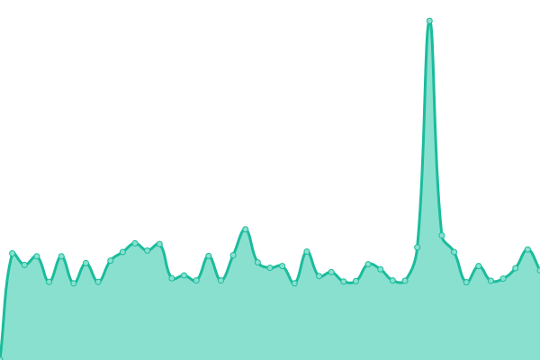 280ms
     
 | 

<a href="https://kizzna.github.io/bovorn-mon/history/mon-17">99.79%</a>
    

|  MON 18 | 🟥 Down | [mon-18.yml](https://github.com/kizzna/bovorn-mon/commits/HEAD/history/mon-18.yml) | 

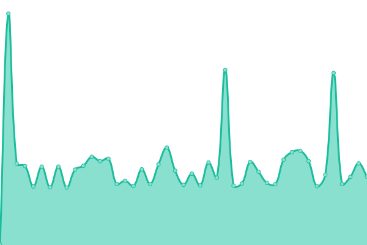 575ms
     
 | 

<a href="https://kizzna.github.io/bovorn-mon/history/mon-18">98.94%</a>
    

|  MON 19 | 🟥 Down | [mon-19.yml](https://github.com/kizzna/bovorn-mon/commits/HEAD/history/mon-19.yml) | 

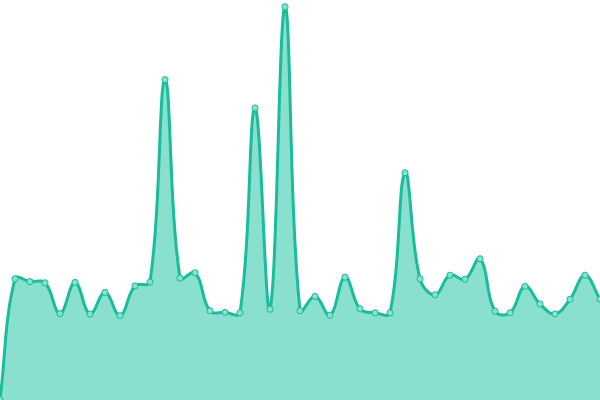 300ms
     
 | 

<a href="https://kizzna.github.io/bovorn-mon/history/mon-19">99.00%</a>
    

|  MON 20 | 🟥 Down | [mon-20.yml](https://github.com/kizzna/bovorn-mon/commits/HEAD/history/mon-20.yml) | 

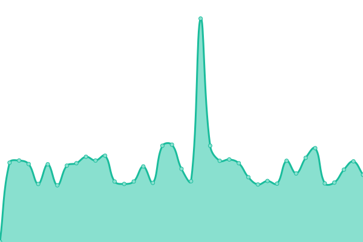 299ms
     
 | 

<a href="https://kizzna.github.io/bovorn-mon/history/mon-20">99.04%</a>
    

<!--end: status pages-->

[**Visit our status website →**](https://kizzna.github.io/bovorn-mon)

## 📄 License

- Powered by: [Upptime](https://github.com/upptime/upptime)
- Code: [MIT](./LICENSE) © [Anand Chowdhary](https://anandchowdhary.com), supported by [Pabio](https://pabio.com)
- Data in the `./history` directory: [Open Database License](https://opendatacommons.org/licenses/odbl/1-0/)
