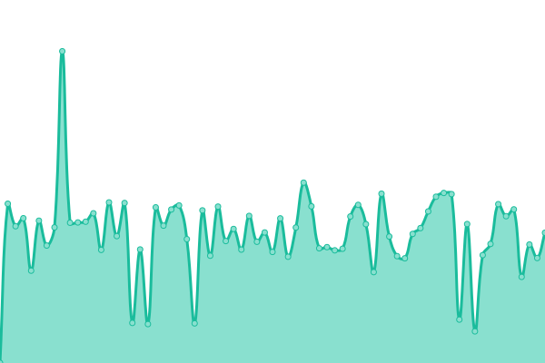
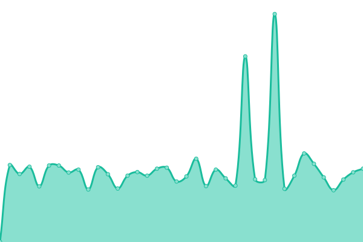
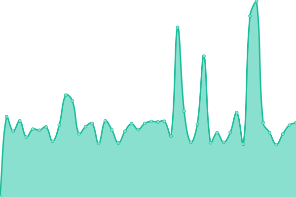
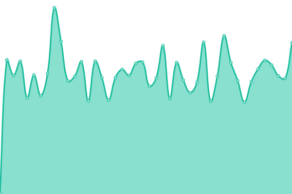

# [📈 Live Status](https://kizzna.github.io/bovorn-mon): <!--live status--> **🟩 All systems operational**

This repository contains the open-source uptime monitor and status page for [kizzna](https://kizzna.github.io/bovorn-mon), powered by [Upptime](https://github.com/upptime/upptime).

With [Upptime](https://upptime.js.org), you can get your own unlimited and free uptime monitor and status page, powered entirely by a GitHub repository. We use [Issues](https://github.com/kizzna/bovorn-mon/issues) as incident reports, [Actions](https://github.com/kizzna/bovorn-mon/actions) as uptime monitors, and [Pages](https://kizzna.github.io/bovorn-mon) for the status page.

<!--start: status pages-->
<!-- This summary is generated by Upptime (https://github.com/upptime/upptime) -->
<!-- Do not edit this manually, your changes will be overwritten -->
<!-- prettier-ignore -->
| URL | Status | History | Response Time | Uptime |
| --- | ------ | ------- | ------------- | ------ |
|  [Mon 001](https://mon.watbovorn.org/10.0.9.1.txt) | 🟩 Up | [mon-001.yml](https://github.com/kizzna/bovorn-mon/commits/HEAD/history/mon-001.yml) | 

 930ms
     
 | 

<a href="https://kizzna.github.io/bovorn-mon/history/mon-001">79.14%</a>
    

|  [Mon 002](https://mon.watbovorn.org/10.0.9.2.txt) | 🟩 Up | [mon-002.yml](https://github.com/kizzna/bovorn-mon/commits/HEAD/history/mon-002.yml) | 

 303ms
     
 | 

<a href="https://kizzna.github.io/bovorn-mon/history/mon-002">79.13%</a>
    

|  [Mon 003](https://mon.watbovorn.org/10.0.9.3.txt) | 🟩 Up | [mon-003.yml](https://github.com/kizzna/bovorn-mon/commits/HEAD/history/mon-003.yml) | 

 282ms
     
 | 

<a href="https://kizzna.github.io/bovorn-mon/history/mon-003">67.08%</a>
    

|  [Mon 004](https://mon.watbovorn.org/10.0.9.4.txt) | 🟩 Up | [mon-004.yml](https://github.com/kizzna/bovorn-mon/commits/HEAD/history/mon-004.yml) | 

 278ms
     
 | 

<a href="https://kizzna.github.io/bovorn-mon/history/mon-004">79.13%</a>
    

|  [Mon 005](https://mon.watbovorn.org/10.0.9.5.txt) | 🟩 Up | [mon-005.yml](https://github.com/kizzna/bovorn-mon/commits/HEAD/history/mon-005.yml) | 

 279ms
     
 | 

<a href="https://kizzna.github.io/bovorn-mon/history/mon-005">79.15%</a>
    

<!--end: status pages-->

[**Visit our status website →**](https://kizzna.github.io/bovorn-mon)

## 📄 License

- Powered by: [Upptime](https://github.com/upptime/upptime)
- Code: [MIT](./LICENSE) © [Anand Chowdhary](https://anandchowdhary.com), supported by [Pabio](https://pabio.com)
- Data in the `./history` directory: [Open Database License](https://opendatacommons.org/licenses/odbl/1-0/)
