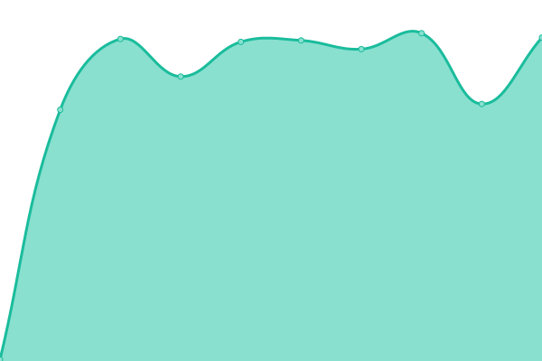
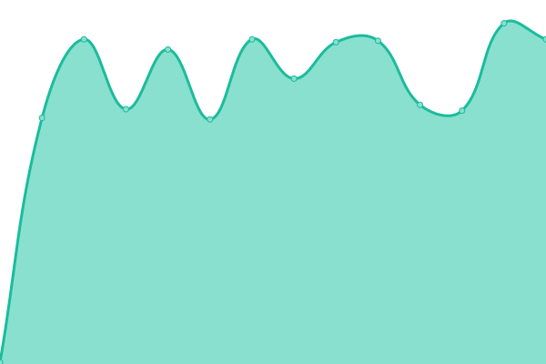

# [📈 Live Status](https://kizzna.github.io/bovorn-mon): <!--live status--> **🟧 Partial outage**

This repository contains the open-source uptime monitor and status page for [kizzna](https://kizzna.github.io/bovorn-mon), powered by [Upptime](https://github.com/upptime/upptime).

With [Upptime](https://upptime.js.org), you can get your own unlimited and free uptime monitor and status page, powered entirely by a GitHub repository. We use [Issues](https://github.com/kizzna/bovorn-mon/issues) as incident reports, [Actions](https://github.com/kizzna/bovorn-mon/actions) as uptime monitors, and [Pages](https://kizzna.github.io/bovorn-mon) for the status page.

<!--start: status pages-->
<!-- This summary is generated by Upptime (https://github.com/upptime/upptime) -->
<!-- Do not edit this manually, your changes will be overwritten -->
<!-- prettier-ignore -->
| URL | Status | History | Response Time | Uptime |
| --- | ------ | ------- | ------------- | ------ |
|  MON-8-11 | 🟩 Up | [mon-8-11.yml](https://github.com/kizzna/bovorn-mon/commits/HEAD/history/mon-8-11.yml) | 

 772ms
     
 | 

<a href="https://kizzna.github.io/bovorn-mon/history/mon-8-11">100.00%</a>
    

|  MON-8-12 | 🟩 Up | [mon-8-12.yml](https://github.com/kizzna/bovorn-mon/commits/HEAD/history/mon-8-12.yml) | 

 199ms
     
 | 

<a href="https://kizzna.github.io/bovorn-mon/history/mon-8-12">100.00%</a>
    

|  MON-8-13 | 🟩 Up | [mon-8-13.yml](https://github.com/kizzna/bovorn-mon/commits/HEAD/history/mon-8-13.yml) | 

 199ms
     
 | 

<a href="https://kizzna.github.io/bovorn-mon/history/mon-8-13">100.00%</a>
    

|  MON-8-14 | 🟩 Up | [mon-8-14.yml](https://github.com/kizzna/bovorn-mon/commits/HEAD/history/mon-8-14.yml) | 

 199ms
     
 | 

<a href="https://kizzna.github.io/bovorn-mon/history/mon-8-14">100.00%</a>
    

|  MON-9-1 | 🟩 Up | [mon-9-1.yml](https://github.com/kizzna/bovorn-mon/commits/HEAD/history/mon-9-1.yml) | 

 199ms
     
 | 

<a href="https://kizzna.github.io/bovorn-mon/history/mon-9-1">100.00%</a>
    

|  MON-9-2 | 🟩 Up | [mon-9-2.yml](https://github.com/kizzna/bovorn-mon/commits/HEAD/history/mon-9-2.yml) | 

 199ms
     
 | 

<a href="https://kizzna.github.io/bovorn-mon/history/mon-9-2">100.00%</a>
    

|  MON-9-3 | 🟩 Up | [mon-9-3.yml](https://github.com/kizzna/bovorn-mon/commits/HEAD/history/mon-9-3.yml) | 

 199ms
     
 | 

<a href="https://kizzna.github.io/bovorn-mon/history/mon-9-3">100.00%</a>
    

|  MON-9-4 | 🟩 Up | [mon-9-4.yml](https://github.com/kizzna/bovorn-mon/commits/HEAD/history/mon-9-4.yml) | 

 199ms
     
 | 

<a href="https://kizzna.github.io/bovorn-mon/history/mon-9-4">100.00%</a>
    

|  MON-9-5 | 🟩 Up | [mon-9-5.yml](https://github.com/kizzna/bovorn-mon/commits/HEAD/history/mon-9-5.yml) | 

 199ms
     
 | 

<a href="https://kizzna.github.io/bovorn-mon/history/mon-9-5">100.00%</a>
    

|  MON-9-6 | 🟩 Up | [mon-9-6.yml](https://github.com/kizzna/bovorn-mon/commits/HEAD/history/mon-9-6.yml) | 

 199ms
     
 | 

<a href="https://kizzna.github.io/bovorn-mon/history/mon-9-6">100.00%</a>
    

|  MON-9-7 | 🟥 Down | [mon-9-7.yml](https://github.com/kizzna/bovorn-mon/commits/HEAD/history/mon-9-7.yml) | 

 199ms
     
 | 

<a href="https://kizzna.github.io/bovorn-mon/history/mon-9-7">0.00%</a>
    

|  MON-9-8 | 🟩 Up | [mon-9-8.yml](https://github.com/kizzna/bovorn-mon/commits/HEAD/history/mon-9-8.yml) | 

 199ms
     
 | 

<a href="https://kizzna.github.io/bovorn-mon/history/mon-9-8">100.00%</a>
    

|  MON-9-9 | 🟩 Up | [mon-9-9.yml](https://github.com/kizzna/bovorn-mon/commits/HEAD/history/mon-9-9.yml) | 

 199ms
     
 | 

<a href="https://kizzna.github.io/bovorn-mon/history/mon-9-9">100.00%</a>
    

|  MON-9-10 | 🟩 Up | [mon-9-10.yml](https://github.com/kizzna/bovorn-mon/commits/HEAD/history/mon-9-10.yml) | 

 199ms
     
 | 

<a href="https://kizzna.github.io/bovorn-mon/history/mon-9-10">100.00%</a>
    

|  MON-9-11 | 🟩 Up | [mon-9-11.yml](https://github.com/kizzna/bovorn-mon/commits/HEAD/history/mon-9-11.yml) | 

 199ms
     
 | 

<a href="https://kizzna.github.io/bovorn-mon/history/mon-9-11">100.00%</a>
    

|  MON-9-12 | 🟩 Up | [mon-9-12.yml](https://github.com/kizzna/bovorn-mon/commits/HEAD/history/mon-9-12.yml) | 

 199ms
     
 | 

<a href="https://kizzna.github.io/bovorn-mon/history/mon-9-12">100.00%</a>
    

|  MON-9-13 | 🟩 Up | [mon-9-13.yml](https://github.com/kizzna/bovorn-mon/commits/HEAD/history/mon-9-13.yml) | 

 199ms
     
 | 

<a href="https://kizzna.github.io/bovorn-mon/history/mon-9-13">100.00%</a>
    

|  MON-9-14 | 🟩 Up | [mon-9-14.yml](https://github.com/kizzna/bovorn-mon/commits/HEAD/history/mon-9-14.yml) | 

 199ms
     
 | 

<a href="https://kizzna.github.io/bovorn-mon/history/mon-9-14">100.00%</a>
    

|  MON-9-15 | 🟩 Up | [mon-9-15.yml](https://github.com/kizzna/bovorn-mon/commits/HEAD/history/mon-9-15.yml) | 

 199ms
     
 | 

<a href="https://kizzna.github.io/bovorn-mon/history/mon-9-15">100.00%</a>
    

|  MON-9-16 | 🟩 Up | [mon-9-16.yml](https://github.com/kizzna/bovorn-mon/commits/HEAD/history/mon-9-16.yml) | 

 199ms
     
 | 

<a href="https://kizzna.github.io/bovorn-mon/history/mon-9-16">100.00%</a>
    

|  MON-9-17 | 🟩 Up | [mon-9-17.yml](https://github.com/kizzna/bovorn-mon/commits/HEAD/history/mon-9-17.yml) | 

 199ms
     
 | 

<a href="https://kizzna.github.io/bovorn-mon/history/mon-9-17">100.00%</a>
    

|  MON-9-18 | 🟩 Up | [mon-9-18.yml](https://github.com/kizzna/bovorn-mon/commits/HEAD/history/mon-9-18.yml) | 

 199ms
     
 | 

<a href="https://kizzna.github.io/bovorn-mon/history/mon-9-18">100.00%</a>
    

|  MON-9-19 | 🟩 Up | [mon-9-19.yml](https://github.com/kizzna/bovorn-mon/commits/HEAD/history/mon-9-19.yml) | 

 199ms
     
 | 

<a href="https://kizzna.github.io/bovorn-mon/history/mon-9-19">100.00%</a>
    

|  MON-9-20 | 🟩 Up | [mon-9-20.yml](https://github.com/kizzna/bovorn-mon/commits/HEAD/history/mon-9-20.yml) | 

 199ms
     
 | 

<a href="https://kizzna.github.io/bovorn-mon/history/mon-9-20">100.00%</a>
    

|  MON-9-21 | 🟩 Up | [mon-9-21.yml](https://github.com/kizzna/bovorn-mon/commits/HEAD/history/mon-9-21.yml) | 

 199ms
     
 | 

<a href="https://kizzna.github.io/bovorn-mon/history/mon-9-21">100.00%</a>
    

|  MON-9-22 | 🟩 Up | [mon-9-22.yml](https://github.com/kizzna/bovorn-mon/commits/HEAD/history/mon-9-22.yml) | 

 199ms
     
 | 

<a href="https://kizzna.github.io/bovorn-mon/history/mon-9-22">100.00%</a>
    

|  MON-9-23 | 🟩 Up | [mon-9-23.yml](https://github.com/kizzna/bovorn-mon/commits/HEAD/history/mon-9-23.yml) | 

 199ms
     
 | 

<a href="https://kizzna.github.io/bovorn-mon/history/mon-9-23">100.00%</a>
    

|  MON-9-24 | 🟩 Up | [mon-9-24.yml](https://github.com/kizzna/bovorn-mon/commits/HEAD/history/mon-9-24.yml) | 

 199ms
     
 | 

<a href="https://kizzna.github.io/bovorn-mon/history/mon-9-24">100.00%</a>
    

|  MON-9-25 | 🟩 Up | [mon-9-25.yml](https://github.com/kizzna/bovorn-mon/commits/HEAD/history/mon-9-25.yml) | 

 199ms
     
 | 

<a href="https://kizzna.github.io/bovorn-mon/history/mon-9-25">100.00%</a>
    

|  MON-9-26 | 🟩 Up | [mon-9-26.yml](https://github.com/kizzna/bovorn-mon/commits/HEAD/history/mon-9-26.yml) | 

 199ms
     
 | 

<a href="https://kizzna.github.io/bovorn-mon/history/mon-9-26">89.64%</a>
    

|  MON-9-27 | 🟥 Down | [mon-9-27.yml](https://github.com/kizzna/bovorn-mon/commits/HEAD/history/mon-9-27.yml) | 

 201ms
     
 | 

<a href="https://kizzna.github.io/bovorn-mon/history/mon-9-27">100.00%</a>
    

|  MON-9-28 | 🟩 Up | [mon-9-28.yml](https://github.com/kizzna/bovorn-mon/commits/HEAD/history/mon-9-28.yml) | 

 199ms
     
 | 

<a href="https://kizzna.github.io/bovorn-mon/history/mon-9-28">100.00%</a>
    

|  MON-9-29 | 🟩 Up | [mon-9-29.yml](https://github.com/kizzna/bovorn-mon/commits/HEAD/history/mon-9-29.yml) | 

 199ms
     
 | 

<a href="https://kizzna.github.io/bovorn-mon/history/mon-9-29">100.00%</a>
    

|  MON-9-30 | 🟩 Up | [mon-9-30.yml](https://github.com/kizzna/bovorn-mon/commits/HEAD/history/mon-9-30.yml) | 

 199ms
     
 | 

<a href="https://kizzna.github.io/bovorn-mon/history/mon-9-30">100.00%</a>
    

|  MON-9-31 | 🟩 Up | [mon-9-31.yml](https://github.com/kizzna/bovorn-mon/commits/HEAD/history/mon-9-31.yml) | 

 199ms
     
 | 

<a href="https://kizzna.github.io/bovorn-mon/history/mon-9-31">100.00%</a>
    

|  MON-9-32 | 🟩 Up | [mon-9-32.yml](https://github.com/kizzna/bovorn-mon/commits/HEAD/history/mon-9-32.yml) | 

 199ms
     
 | 

<a href="https://kizzna.github.io/bovorn-mon/history/mon-9-32">100.00%</a>
    

|  MON-9-33 | 🟥 Down | [mon-9-33.yml](https://github.com/kizzna/bovorn-mon/commits/HEAD/history/mon-9-33.yml) | 

 199ms
     
 | 

<a href="https://kizzna.github.io/bovorn-mon/history/mon-9-33">100.00%</a>
    

|  MON-9-34 | 🟥 Down | [mon-9-34.yml](https://github.com/kizzna/bovorn-mon/commits/HEAD/history/mon-9-34.yml) | 

 199ms
     
 | 

<a href="https://kizzna.github.io/bovorn-mon/history/mon-9-34">100.00%</a>
    

|  MON-9-35 | 🟩 Up | [mon-9-35.yml](https://github.com/kizzna/bovorn-mon/commits/HEAD/history/mon-9-35.yml) | 

 199ms
     
 | 

<a href="https://kizzna.github.io/bovorn-mon/history/mon-9-35">100.00%</a>
    

|  MON-9-36 | 🟩 Up | [mon-9-36.yml](https://github.com/kizzna/bovorn-mon/commits/HEAD/history/mon-9-36.yml) | 

 199ms
     
 | 

<a href="https://kizzna.github.io/bovorn-mon/history/mon-9-36">100.00%</a>
    

|  MON-9-37 | 🟥 Down | [mon-9-37.yml](https://github.com/kizzna/bovorn-mon/commits/HEAD/history/mon-9-37.yml) | 

 199ms
     
 | 

<a href="https://kizzna.github.io/bovorn-mon/history/mon-9-37">100.00%</a>
    

|  MON-9-38 | 🟩 Up | [mon-9-38.yml](https://github.com/kizzna/bovorn-mon/commits/HEAD/history/mon-9-38.yml) | 

 199ms
     
 | 

<a href="https://kizzna.github.io/bovorn-mon/history/mon-9-38">100.00%</a>
    

|  MON-9-39 | 🟩 Up | [mon-9-39.yml](https://github.com/kizzna/bovorn-mon/commits/HEAD/history/mon-9-39.yml) | 

 199ms
     
 | 

<a href="https://kizzna.github.io/bovorn-mon/history/mon-9-39">100.00%</a>
    

|  MON-9-40 | 🟩 Up | [mon-9-40.yml](https://github.com/kizzna/bovorn-mon/commits/HEAD/history/mon-9-40.yml) | 

 199ms
     
 | 

<a href="https://kizzna.github.io/bovorn-mon/history/mon-9-40">100.00%</a>
    

|  MON-9-41 | 🟩 Up | [mon-9-41.yml](https://github.com/kizzna/bovorn-mon/commits/HEAD/history/mon-9-41.yml) | 

 199ms
     
 | 

<a href="https://kizzna.github.io/bovorn-mon/history/mon-9-41">100.00%</a>
    

|  MON-9-42 | 🟩 Up | [mon-9-42.yml](https://github.com/kizzna/bovorn-mon/commits/HEAD/history/mon-9-42.yml) | 

 199ms
     
 | 

<a href="https://kizzna.github.io/bovorn-mon/history/mon-9-42">100.00%</a>
    

|  MON-9-43 | 🟩 Up | [mon-9-43.yml](https://github.com/kizzna/bovorn-mon/commits/HEAD/history/mon-9-43.yml) | 

 199ms
     
 | 

<a href="https://kizzna.github.io/bovorn-mon/history/mon-9-43">100.00%</a>
    

|  MON-9-44 | 🟩 Up | [mon-9-44.yml](https://github.com/kizzna/bovorn-mon/commits/HEAD/history/mon-9-44.yml) | 

 199ms
     
 | 

<a href="https://kizzna.github.io/bovorn-mon/history/mon-9-44">100.00%</a>
    

|  MON-9-45 | 🟩 Up | [mon-9-45.yml](https://github.com/kizzna/bovorn-mon/commits/HEAD/history/mon-9-45.yml) | 

 199ms
     
 | 

<a href="https://kizzna.github.io/bovorn-mon/history/mon-9-45">100.00%</a>
    

|  MON-9-46 | 🟩 Up | [mon-9-46.yml](https://github.com/kizzna/bovorn-mon/commits/HEAD/history/mon-9-46.yml) | 

 199ms
     
 | 

<a href="https://kizzna.github.io/bovorn-mon/history/mon-9-46">100.00%</a>
    

|  MON-9-47 | 🟩 Up | [mon-9-47.yml](https://github.com/kizzna/bovorn-mon/commits/HEAD/history/mon-9-47.yml) | 

 199ms
     
 | 

<a href="https://kizzna.github.io/bovorn-mon/history/mon-9-47">100.00%</a>
    

|  MON-9-48 | 🟩 Up | [mon-9-48.yml](https://github.com/kizzna/bovorn-mon/commits/HEAD/history/mon-9-48.yml) | 

 199ms
     
 | 

<a href="https://kizzna.github.io/bovorn-mon/history/mon-9-48">100.00%</a>
    

|  MON-9-49 | 🟩 Up | [mon-9-49.yml](https://github.com/kizzna/bovorn-mon/commits/HEAD/history/mon-9-49.yml) | 

 199ms
     
 | 

<a href="https://kizzna.github.io/bovorn-mon/history/mon-9-49">100.00%</a>
    

|  MON-9-50 | 🟩 Up | [mon-9-50.yml](https://github.com/kizzna/bovorn-mon/commits/HEAD/history/mon-9-50.yml) | 

 199ms
     
 | 

<a href="https://kizzna.github.io/bovorn-mon/history/mon-9-50">100.00%</a>
    

|  MON-9-51 | 🟩 Up | [mon-9-51.yml](https://github.com/kizzna/bovorn-mon/commits/HEAD/history/mon-9-51.yml) | 

 199ms
     
 | 

<a href="https://kizzna.github.io/bovorn-mon/history/mon-9-51">100.00%</a>
    

|  MON-9-52 | 🟩 Up | [mon-9-52.yml](https://github.com/kizzna/bovorn-mon/commits/HEAD/history/mon-9-52.yml) | 

 199ms
     
 | 

<a href="https://kizzna.github.io/bovorn-mon/history/mon-9-52">100.00%</a>
    

|  MON-9-53 | 🟩 Up | [mon-9-53.yml](https://github.com/kizzna/bovorn-mon/commits/HEAD/history/mon-9-53.yml) | 

 199ms
     
 | 

<a href="https://kizzna.github.io/bovorn-mon/history/mon-9-53">100.00%</a>
    

|  MON-9-54 | 🟩 Up | [mon-9-54.yml](https://github.com/kizzna/bovorn-mon/commits/HEAD/history/mon-9-54.yml) | 

 199ms
     
 | 

<a href="https://kizzna.github.io/bovorn-mon/history/mon-9-54">100.00%</a>
    

|  MON-9-55 | 🟩 Up | [mon-9-55.yml](https://github.com/kizzna/bovorn-mon/commits/HEAD/history/mon-9-55.yml) | 

 199ms
     
 | 

<a href="https://kizzna.github.io/bovorn-mon/history/mon-9-55">100.00%</a>
    

|  MON-9-56 | 🟩 Up | [mon-9-56.yml](https://github.com/kizzna/bovorn-mon/commits/HEAD/history/mon-9-56.yml) | 

 199ms
     
 | 

<a href="https://kizzna.github.io/bovorn-mon/history/mon-9-56">100.00%</a>
    

|  MON-9-57 | 🟩 Up | [mon-9-57.yml](https://github.com/kizzna/bovorn-mon/commits/HEAD/history/mon-9-57.yml) | 

 199ms
     
 | 

<a href="https://kizzna.github.io/bovorn-mon/history/mon-9-57">100.00%</a>
    

|  MON-9-58 | 🟩 Up | [mon-9-58.yml](https://github.com/kizzna/bovorn-mon/commits/HEAD/history/mon-9-58.yml) | 

 199ms
     
 | 

<a href="https://kizzna.github.io/bovorn-mon/history/mon-9-58">100.00%</a>
    

|  MON-9-59 | 🟩 Up | [mon-9-59.yml](https://github.com/kizzna/bovorn-mon/commits/HEAD/history/mon-9-59.yml) | 

 199ms
     
 | 

<a href="https://kizzna.github.io/bovorn-mon/history/mon-9-59">100.00%</a>
    

|  MON-9-60 | 🟩 Up | [mon-9-60.yml](https://github.com/kizzna/bovorn-mon/commits/HEAD/history/mon-9-60.yml) | 

 199ms
     
 | 

<a href="https://kizzna.github.io/bovorn-mon/history/mon-9-60">100.00%</a>
    

|  MON-9-61 | 🟩 Up | [mon-9-61.yml](https://github.com/kizzna/bovorn-mon/commits/HEAD/history/mon-9-61.yml) | 

 199ms
     
 | 

<a href="https://kizzna.github.io/bovorn-mon/history/mon-9-61">100.00%</a>
    

|  MON-9-62 | 🟩 Up | [mon-9-62.yml](https://github.com/kizzna/bovorn-mon/commits/HEAD/history/mon-9-62.yml) | 

 199ms
     
 | 

<a href="https://kizzna.github.io/bovorn-mon/history/mon-9-62">100.00%</a>
    

|  MON-9-63 | 🟩 Up | [mon-9-63.yml](https://github.com/kizzna/bovorn-mon/commits/HEAD/history/mon-9-63.yml) | 

 199ms
     
 | 

<a href="https://kizzna.github.io/bovorn-mon/history/mon-9-63">100.00%</a>
    

|  MON-9-64 | 🟩 Up | [mon-9-64.yml](https://github.com/kizzna/bovorn-mon/commits/HEAD/history/mon-9-64.yml) | 

 198ms
     
 | 

<a href="https://kizzna.github.io/bovorn-mon/history/mon-9-64">100.00%</a>
    

|  MON-9-65 | 🟩 Up | [mon-9-65.yml](https://github.com/kizzna/bovorn-mon/commits/HEAD/history/mon-9-65.yml) | 

 199ms
     
 | 

<a href="https://kizzna.github.io/bovorn-mon/history/mon-9-65">100.00%</a>
    

|  MON-9-66 | 🟩 Up | [mon-9-66.yml](https://github.com/kizzna/bovorn-mon/commits/HEAD/history/mon-9-66.yml) | 

 199ms
     
 | 

<a href="https://kizzna.github.io/bovorn-mon/history/mon-9-66">100.00%</a>
    

|  MON-9-67 | 🟩 Up | [mon-9-67.yml](https://github.com/kizzna/bovorn-mon/commits/HEAD/history/mon-9-67.yml) | 

 199ms
     
 | 

<a href="https://kizzna.github.io/bovorn-mon/history/mon-9-67">100.00%</a>
    

|  MON-9-68 | 🟩 Up | [mon-9-68.yml](https://github.com/kizzna/bovorn-mon/commits/HEAD/history/mon-9-68.yml) | 

 199ms
     
 | 

<a href="https://kizzna.github.io/bovorn-mon/history/mon-9-68">100.00%</a>
    

|  MON-9-69 | 🟩 Up | [mon-9-69.yml](https://github.com/kizzna/bovorn-mon/commits/HEAD/history/mon-9-69.yml) | 

 199ms
     
 | 

<a href="https://kizzna.github.io/bovorn-mon/history/mon-9-69">100.00%</a>
    

|  MON-9-70 | 🟩 Up | [mon-9-70.yml](https://github.com/kizzna/bovorn-mon/commits/HEAD/history/mon-9-70.yml) | 

 199ms
     
 | 

<a href="https://kizzna.github.io/bovorn-mon/history/mon-9-70">100.00%</a>
    

|  MON-9-71 | 🟩 Up | [mon-9-71.yml](https://github.com/kizzna/bovorn-mon/commits/HEAD/history/mon-9-71.yml) | 

 199ms
     
 | 

<a href="https://kizzna.github.io/bovorn-mon/history/mon-9-71">100.00%</a>
    

|  MON-9-72 | 🟩 Up | [mon-9-72.yml](https://github.com/kizzna/bovorn-mon/commits/HEAD/history/mon-9-72.yml) | 

 199ms
     
 | 

<a href="https://kizzna.github.io/bovorn-mon/history/mon-9-72">100.00%</a>
    

|  MON-9-73 | 🟩 Up | [mon-9-73.yml](https://github.com/kizzna/bovorn-mon/commits/HEAD/history/mon-9-73.yml) | 

 199ms
     
 | 

<a href="https://kizzna.github.io/bovorn-mon/history/mon-9-73">100.00%</a>
    

|  MON-9-74 | 🟩 Up | [mon-9-74.yml](https://github.com/kizzna/bovorn-mon/commits/HEAD/history/mon-9-74.yml) | 

 199ms
     
 | 

<a href="https://kizzna.github.io/bovorn-mon/history/mon-9-74">100.00%</a>
    

|  MON-9-75 | 🟩 Up | [mon-9-75.yml](https://github.com/kizzna/bovorn-mon/commits/HEAD/history/mon-9-75.yml) | 

 199ms
     
 | 

<a href="https://kizzna.github.io/bovorn-mon/history/mon-9-75">100.00%</a>
    

|  MON-9-76 | 🟩 Up | [mon-9-76.yml](https://github.com/kizzna/bovorn-mon/commits/HEAD/history/mon-9-76.yml) | 

 199ms
     
 | 

<a href="https://kizzna.github.io/bovorn-mon/history/mon-9-76">100.00%</a>
    

|  MON-9-77 | 🟩 Up | [mon-9-77.yml](https://github.com/kizzna/bovorn-mon/commits/HEAD/history/mon-9-77.yml) | 

 199ms
     
 | 

<a href="https://kizzna.github.io/bovorn-mon/history/mon-9-77">100.00%</a>
    

|  MON-9-78 | 🟩 Up | [mon-9-78.yml](https://github.com/kizzna/bovorn-mon/commits/HEAD/history/mon-9-78.yml) | 

 199ms
     
 | 

<a href="https://kizzna.github.io/bovorn-mon/history/mon-9-78">100.00%</a>
    

|  MON-9-79 | 🟩 Up | [mon-9-79.yml](https://github.com/kizzna/bovorn-mon/commits/HEAD/history/mon-9-79.yml) | 

 199ms
     
 | 

<a href="https://kizzna.github.io/bovorn-mon/history/mon-9-79">100.00%</a>
    

|  MON-9-80 | 🟥 Down | [mon-9-80.yml](https://github.com/kizzna/bovorn-mon/commits/HEAD/history/mon-9-80.yml) | 

 199ms
     
 | 

<a href="https://kizzna.github.io/bovorn-mon/history/mon-9-80">100.00%</a>
    

<!--end: status pages-->

[**Visit our status website →**](https://kizzna.github.io/bovorn-mon)

## 📄 License

- Powered by: [Upptime](https://github.com/upptime/upptime)
- Code: [MIT](./LICENSE) © [Anand Chowdhary](https://anandchowdhary.com), supported by [Pabio](https://pabio.com)
- Data in the `./history` directory: [Open Database License](https://opendatacommons.org/licenses/odbl/1-0/)
